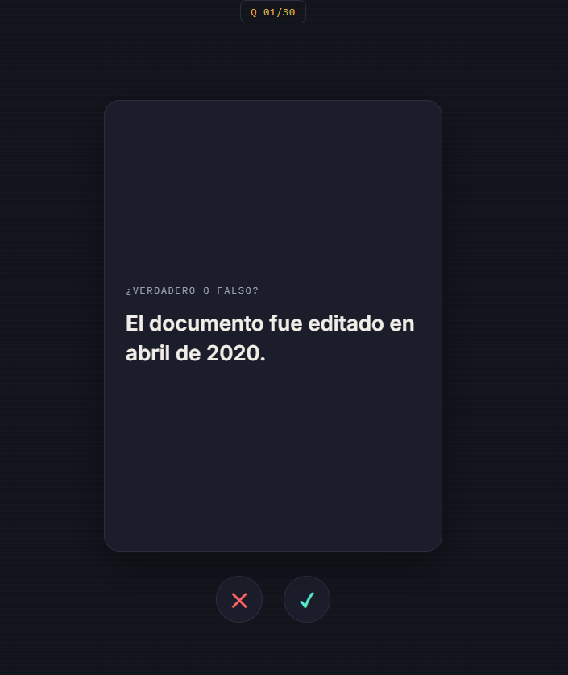

# Folio

**Turn any PDF into swipeable True/False exam cards, generated with AI.**

Upload your notes, books or papers and Folio generates statements about the key concepts. Swipe right for *true*, left for *false*, and get instant feedback with the exact snippet from your document that justifies the answer.

>  This is a **prototype**. It is designed to be easy to run and easy to migrate to production, but it is not production-ready as is.

## Screenshots

| Library | Study deck |
|---------|------------|
|  |  |
| Upload a new PDF or reopen a previously processed document. | Swipe right for *true*, left for *false*, or use the ✕ / ✓ buttons. |

## Features

- **PDF → study cards**: generates 30 True/False statements per document (configurable).
- **Swipe-style study deck**: drag cards or use the ✕ / ✓ buttons.
- **Grounded explanations**: every card includes a short snippet from the source text explaining why it is true or false.
- **OCR fallback**: scanned PDFs and image-only pages are handled with Tesseract (Spanish + English).
- **Per-document caching**: documents are identified by SHA-256 hash, so re-uploading the same PDF costs zero AI calls.
- **Live progress**: the UI shows a progress bar while cards are being generated.
- **Personal library**: previously processed documents stay available.
- **No sign-up required.**
- **Single container**: FastAPI serves both the API and the static frontend.

## How it works

```
Client (frontend/index.html)
      |
      v
FastAPI (backend/main.py) ---------> SQLite (prototype) / Postgres (production)
      |
      | background job
      v
BackgroundTasks (prototype) / Celery + Redis (production)
      |
      v
Groq API (OpenAI-compatible) -> JSON questions -> saved in the database
```

Processing pipeline for each uploaded PDF:

1. **Hash & cache check** – if the SHA-256 of the file was already processed, return the existing result.
2. **Text extraction** – PyMuPDF extracts text page by page; pages with fewer than 20 characters fall back to OCR (Tesseract at 200 dpi). Text is truncated to ~40,000 characters.
3. **Title detection** – PDF metadata → first title-like line → file name.
4. **Question generation** – the text is split into chunks and small batches (5 cards per call) are requested **sequentially** from the LLM until the target is reached. Duplicates and malformed items are discarded, and rate limits (HTTP 429) are retried using the wait time Groq reports.
5. **Persistence** – questions are stored and the document is marked `ready` (or `failed` with an error message).

The frontend polls the document status and shows progress until it is ready.

## Tech stack

| Layer       | Technology                                                        |
|-------------|-------------------------------------------------------------------|
| Backend     | Python 3.11, FastAPI, Uvicorn, httpx                              |
| PDF / OCR   | PyMuPDF, Tesseract (via pytesseract), Pillow                      |
| AI          | [Groq](https://groq.com) API, model `openai/gpt-oss-120b`         |
| Database    | SQLite (prototype)                                                |
| Frontend    | Vanilla HTML/CSS/JS (no build step)                               |
| Deployment  | Docker                                                            |

## Project structure

```
.
├── backend/
│   ├── main.py            # FastAPI app: API, PDF processing, AI generation
│   └── requirements.txt
├── frontend/
│   ├── index.html         # App: library, upload and swipe study deck
│   └── landing.html       # Marketing landing page
├── docs/
│   └── screenshots/       # Images used in this README
├── Dockerfile
├── .dockerignore
├── .env.example           # Template for your environment variables
└── .gitignore
```

## Getting started

### Prerequisites

- A free **Groq API key**: <https://console.groq.com/keys>
- Either **Docker**, or **Python 3.11+** with **Tesseract** installed locally (including the `spa` language pack)

### Option 1 — Docker (recommended)

```bash
git clone https://github.com/<your-user>/EasyStudy.git
cd EasyStudy

cp .env.example .env        # then edit .env and set GROQ_API_KEY

docker build -t folio .
docker run --rm -p 8000:8000 --env-file .env folio
```

Open <http://localhost:8000>.

### Option 2 — Local

```bash
# System dependencies (Debian/Ubuntu)
sudo apt-get install tesseract-ocr tesseract-ocr-spa

cd backend
python -m venv .venv
source .venv/bin/activate          # Windows: .venv\Scripts\activate
pip install -r requirements.txt

export GROQ_API_KEY=your_groq_api_key_here    # Windows (PowerShell): $env:GROQ_API_KEY="..."
uvicorn main:app --reload --port 8000
```

Open <http://localhost:8000>.

## Configuration

| Variable       | Required | Description                                  |
|----------------|----------|----------------------------------------------|
| `GROQ_API_KEY` | Yes      | Your Groq API key. Read from the environment; never hardcode it. |

Tunable constants at the top of `backend/main.py`:

| Constant         | Default                 | Description                                                  |
|------------------|-------------------------|--------------------------------------------------------------|
| `N_QUESTIONS`    | `30`                    | Cards generated per document                                 |
| `BATCH_SIZE`     | `5`                     | Cards requested per AI call (smaller batches are more reliable) |
| `GROQ_MODEL`     | `openai/gpt-oss-120b`   | Model used for generation                                    |
| `OCR_LANG`       | `spa+eng`               | Tesseract languages                                          |
| `OCR_MIN_CHARS`  | `20`                    | Below this many characters a page is treated as scanned      |

> **Language note:** the generation prompt and the UI are currently in **Spanish**, so cards are generated in Spanish regardless of the PDF language. To change this, edit `QUESTION_GEN_PROMPT` and the system message in `backend/main.py`.

## API reference

Base path: `/api`

| Method | Endpoint                         | Description                                                                 |
|--------|----------------------------------|-----------------------------------------------------------------------------|
| `POST` | `/documents`                     | Upload a PDF (`multipart/form-data`, field `file`). Returns `{document_id, status, cached}`. |
| `GET`  | `/documents`                     | List all documents with status, progress and question count.                |
| `GET`  | `/documents/{id}`                | Get processing status: `processing`, `ready` or `failed` (+ progress/error).|
| `GET`  | `/documents/{id}/questions`      | Get the generated cards. Returns `409` if the document is not ready yet.    |
| `POST` | `/questions/{id}/answer`         | Record an answer. Body: `{"is_correct": true}`.                             |

Example:

```bash
curl -F "file=@notes.pdf" http://localhost:8000/api/documents
# {"document_id":"3f6c…","status":"processing","cached":false}

curl http://localhost:8000/api/documents/3f6c…
curl http://localhost:8000/api/documents/3f6c…/questions
```

Interactive docs are available at <http://localhost:8000/docs> (FastAPI Swagger UI).

## Data model

- **documents** – `id`, `content_hash` (unique), `filename`, `title`, `status`, `error`, `progress_done`, `progress_total`, `created_at`
- **questions** – `id`, `document_id`, `statement`, `is_true`, `explanation`, `order_index`
- **answers** – `id`, `question_id`, `is_correct`, `answered_at`

## Roadmap to production

Places in the code marked with `# PROD:` show what to change:

- [ ] SQLite → **Postgres**
- [ ] `BackgroundTasks` → **Celery + Redis** worker, scaled separately from the web process
- [ ] Local `uploads/` → **S3 / Cloudflare R2**
- [ ] Restrict **CORS** (currently `allow_origins=["*"]`) to the real frontend domain
- [ ] Add **authentication** and per-user document filtering (documents are currently global)
- [ ] Add **rate limiting** and upload size limits
- [ ] Real **chunking** instead of truncating to ~40k characters
- [ ] Validate the `/answer` payload with a Pydantic model

## Security notes

- The API key is read **only** from the `GROQ_API_KEY` environment variable. `.env` is git-ignored and docker-ignored; commit only `.env.example`.
- If you ever commit a key by mistake, **revoke it** in the Groq console immediately; removing it from git history is not enough.

## License

No license has been specified yet. Add a `LICENSE` file (e.g. MIT) before publishing if you want others to be able to use the code.
